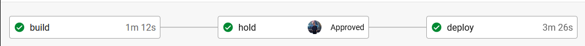
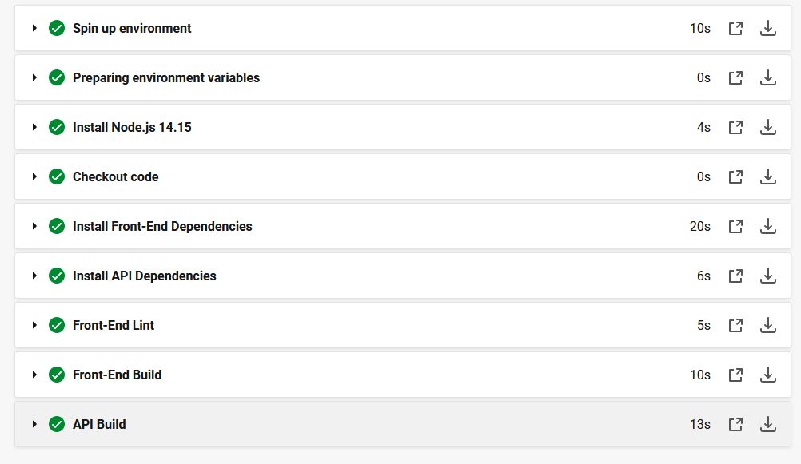
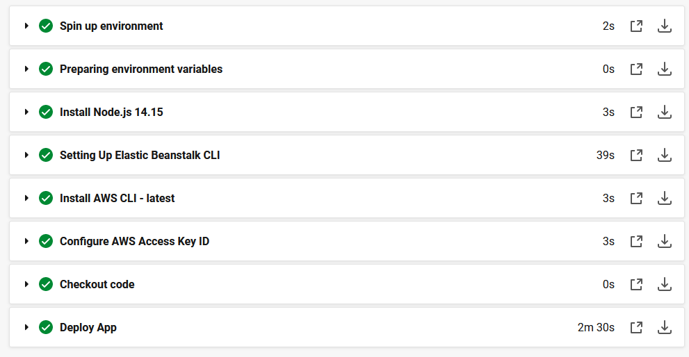

# pipeline process

## build workflow

build workflow steps:
- Starts by setting up the environment.
- Installs front and back-end dependencies.
- Lints front end code to ensure best practices of the code are made and there are no type errors.
- Building the front end code to ensure it works correctly.
- Finally it builds the back end code with required procedures. 
---
## deploy workflow

deploy workflow steps:
- Starts by setting up the environment.
- Gets the environment variables ready
- First the CircleCI starts by setting up the elasticbeanstalk CLI & AWS CLI
- Configures AWS CLI credentials using the provided environment variables
- Deploys the applications
  - Starts by installing the dependencies
    - installs front-end dependencies
    - installs back-end dependencies
  - Starts building the application for both front and back end
  - Deploys the application after the building is complete
    - The building of the backend API:  First the required dependencies are installed and typescript code is transpiled to javascript after that it starts uploading the code to elasticbeanstalk
    - The building of the frontend : The angular code is first rendered and the uploaded to the s3 bucket 

